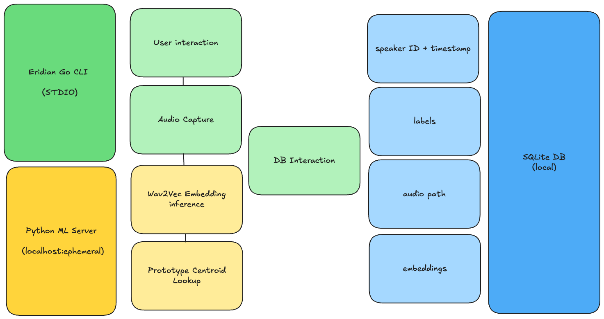

# Eridian

Eridian is a living dictionary builder for unknown languages. You speak a word, assign it an English meaning, and over time build a semantic map of any spoken language.

**It does not produce grammatically correct sentences. It surfaces meaning units, which should be enough to communicate with**

> Inspired by Project Hail Mary, Eridian (loosely) replicates the process Grace uses to map Rocky's language to English, one word at a time. Also, if I ever actually meet something like Rocky, I'm going to need to start somewhere too. 

---

## Installation 

TODO

---

## Usage

Eridian is a single Go CLI, there is nothing else to install or manage.

On first run, Eridian will bootstrap its own ML backend:

```bash
$ eridian label
=> First run detected. Eridian requires a Python ML backend.
=> Installing UV... done
=> Installing eridian-ml... done
=> Starting ML service... done

Ready. Speak a word!
```

This happens once. After that, the ML service is managed automatically in the background and the CLI behaves as if it is a single tool.

---
## Commands
    eridian new <language>     Create a new language dictionary
    eridian use <language>     Switch active language
    eridian list               Show all languages
    eridian label              Speak a word, assign a label
    eridian translate          Speak and get meaning units back
    eridian edit               Interactive TUI to manage entries
    eridian clean              Wipe all entries for active language
    eridian status             Dictionary size, last rebuild, active language
---

## Architecture




Runs fully offline. No external model dependencies after first install.

## Phases

### Phase 0 — Foundations
Repo structure, tooling, and the language boundary between the Go CLI and Python
ML service. SQLite schema defined. CLI commands stubbed out. FastAPI service running with a health check. UV bootstrapping logic implemented. No ML yet — just plumbing validated end to end.

### Phase 1 — Living Dictionary
The core of the project. Speak a word into the CLI, assign an English label, and
the embedding is stored in the database. `rebuild` recomputes prototype centroids
from all stored embeddings. `translate` captures audio, finds the nearest centroid
match, and returns the top results with confidence scores.

Speaker must pause between words. No segmentation yet.
This is the "Grace and Rocky building their first shared vocabulary" milestone.

### Phase 2 — Pause-Based Segmentation
Silence detection added to the Go audio capture layer. Speaking continuously now
automatically slices the audio stream on pauses, feeding each slice through the
Phase 1 pipeline independently. Output becomes a sequence of English meaning units
in spoken order.

    [shadow] [ancient] [stone-place] [descend]

The first time the system feels like a translator rather than a dictionary.

---
